# ICP DAO

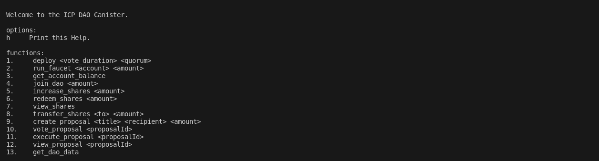

## Disclaimer

This is a test canister and should not be used in production.

This DAO contract:

- Collects investors money (ICP) & allocate shares
- Keep track of investor contributions with shares
- Allow investors to transfer shares
- Allow investment proposals to be created and voted
- Execute successful investment proposals (i.e send money)
- The number of votes an investor has is equivalent to the number of shares the investor has.
- Once an investor votes for a proposal his funds are locked for the duration of the proposal voting period. (A safety measure to avoid drainage of total shares before the quorum is calculated.) and once the investor fund are locked, they won't be able to transfer them or redeem them until the voting period ends.

## Info

To learn more before you start working with icp_dao, see the following documentation available online:

- [Quick Start](https://internetcomputer.org/docs/quickstart/quickstart-intro)
- [SDK Developer Tools](https://internetcomputer.org/docs/developers-guide/sdk-guide)
- [Rust Canister Devlopment Guide](https://internetcomputer.org/docs/rust-guide/rust-intro)
- [ic-cdk](https://docs.rs/ic-cdk)
- [ic-cdk-macros](https://docs.rs/ic-cdk-macros)
- [Candid Introduction](https://internetcomputer.org/docs/candid-guide/candid-intro)
- [JavaScript API Reference](https://erxue-5aaaa-aaaab-qaagq-cai.raw.icp0.io)

If you want to start working on your project right away, you might want to try the following commands:

```bash
cd icp_dao/
dfx help
dfx canister --help
```

## Running the project locally

If you want to test your project locally, you can use the following commands:

```bash
# Starts the replica, running in the background
dfx start --background --clean
```

Next we are going to create the following identities on our dfx instance, these identities make the creation of the ledger seamless. For more information about the identities check the [ICRC1 tutorial](https://internetcomputer.org/docs/current/developer-docs/integrations/icrc-1/icrc1-ledger-setup)

```bash
# The minter identity
dfx identity new minter

# The archive controller
dfx identity new archive_controller
```

Then we proceed to deploy the ICRC1 Ledger, a script has been supplied for that. This sets up the ledger.

```bash
npm run deploy-ledger
```

Next we look at the dao script located at `./scripts/dao.sh`. This script contains all the functions available to the dao canister and their respective implementation. All you need to do is to run them. To view the available functions and the arguments they take in run the command below.

```bash
npm run dao help
```

You get this response.

```bash
Welcome to the ICP DAO Canister.

functions:
1.     deploy <vote_duration> <quorum>
2.     run_faucet <account> <amount>
3.     get_account_balance
4.     join_dao <amount>
5.     increase_shares <amount>
6.     redeem_shares <amount>
7.     view_shares
8.     transfer_shares <to> <amount>
9.     create_proposal <title> <recipient> <amount>
10.    vote_proposal <proposalId>
11.    execute_proposal <proposalId>
12.    view_proposal <proposalId>
13.    get_dao_data
14.    help
```

So now we use the deploy function and deploy the dao supplying the voting duration in minutes as the first argument and the quorum percentage required for a proposal to be executed successfully.

```bash
# npm run dao deploy <voting_duration> <quorum %>
npm run dao deploy 15 70
```

Once the job completes, your application will be available at `http://localhost:4943?canisterId={asset_canister_id}`.

Next we are going to try the remaining functions

1. Getting test tokens from the minter account. This sends tokens from ledger to the current dfx identity.

    ```bash
    # npm run dao run_faucet <amount> 
    npm run dao run_faucet 1_000_000
    ```

    You can check the amount of tokens received by calling the `get_account_balance` function

    ```bash
    npm run dao get_account_balance 
    ```

2. Next call the `join_dao` function to join the dao, note there are two transactions here. The first being the approve function which approves the canister to be able to spend the accounts ledger token then the join dao function.

    ```bash
    # npm run dao join_dao <amount> 
    npm run dao join_dao 1_000_000
    ```

    N/B: There's a `1000` ledger token transfer fee, so paying 10_000 tokens to join the dao  means you'll receive 9000 shares.

    You can check the amount of shares received by calling the `view_shares` function

    ```bash
    npm run dao view_shares 
    ```

    Try testing the other shares related functions

    ```bash
    # increase shares
    npm run dao increase_shares <amount>

    # redeem shares
    npm run dao redeem_shares <amount>
    ```

    N/B: Due to the  `1000` ledger token transfer fee, so redeeming 10_000 tokens means you'll receive 9000 tokens.

    To transfer shares to another user, you need to use the create an identity

    ```bash
    dfx identity new newuser

    npm run dao transfer_shares newuser <amount>
    ```

3. Next to create a proposal call the `create_proposal` function.

    ```bash
    # npm run dao create_proposal <title> <recipient identity> <amount> 
    npm run dao create_proposal Test-Proposal account2 10_000
    ```

    N/B: There's a `1000` ledger token transfer fee, so paying 10_000 tokens recipient means recipient will receive 9000 tokens.

    To view proposal call the  `view_proposal` function passing in the proposal id.

    ```bash
    npm run dao view_proposal <proposal_id>
    ```

    To vote and execute proposals just call the commands passing in the proposal id

    ```bash
    # vote proposal
    npm run dao vote_proposal <proposal_id>

    # execute proposal
    npm run dao execute_proposal <proposal_id>
    ```

## For Testers

I recommend generating various identities to test the canister. Simply switch between these identities before making function calls.

For example in the `create_proposal` and `transfer_shares` function the recipient to be passed in is the identity of the recipient.

To create identities

```bash
# dfx identity new <identity_name>
dfx identity new account1
dfx identity new account2
```

To switch between identities:

```bash
# dfx identity use <identity_name>
dfx identity use account1
dfx identity use account2
```

And to know which identity you're on call:

```bash
dfx identity whoami
```

## Example User Experience

1. Deploying the Ledger

    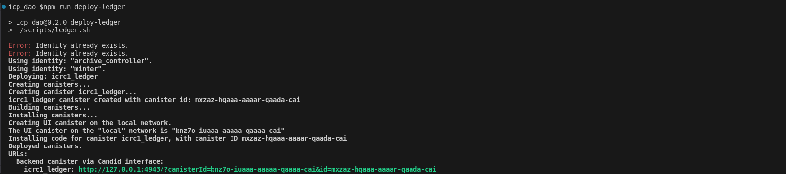

2. Deploying the Dao Canister

    

3. Creating Identities for testing

    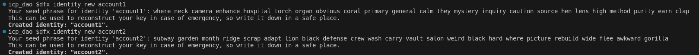

4. Getting tokens from the faucet

   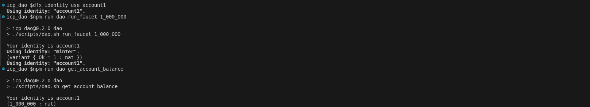

5. Joining the dao

    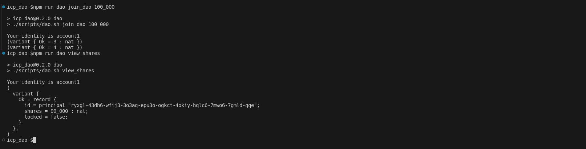

6. Increasing shares in dao

    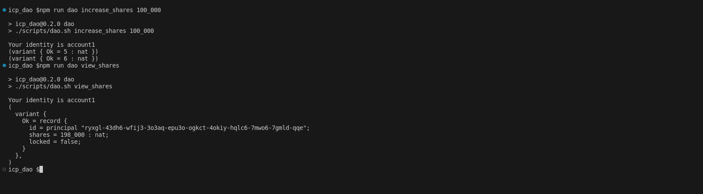

7. Redeeming shares in dao

    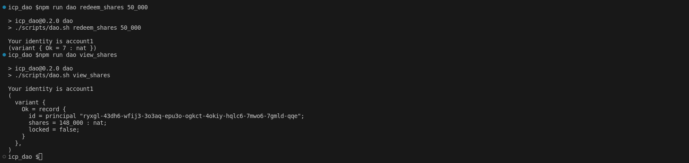

8. Transferring shares in dao

    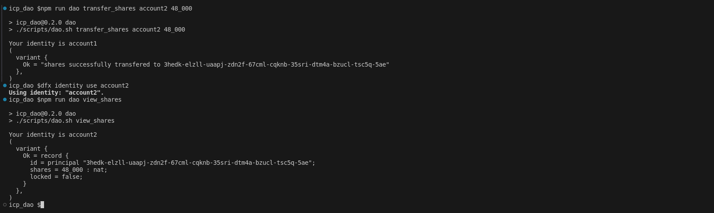

9. Creating a proposal

    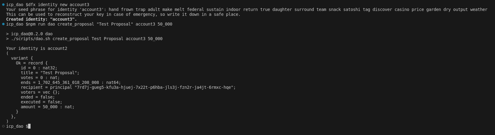

10. Getting dao data

    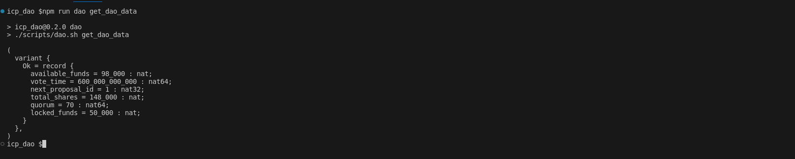

11. Voting for a proposal

    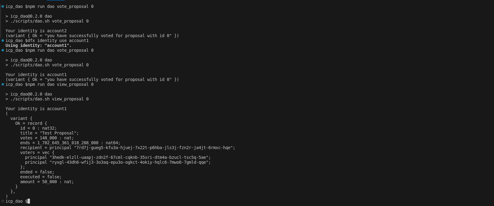

12. Executing a proposal

    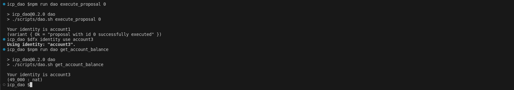
